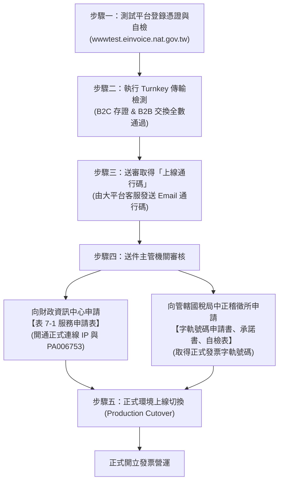

# 奧銳有限公司 電子發票（B2B & B2C）專案上線與申辦總指引

本文件統整「奧銳有限公司」（統一編號：`00015555`，繞送代碼：`PA006753`）完成財政部電子發票自建 Turnkey 系統上線所需之全套行政申辦、線上檢測與系統切換步驟。

---

## 壹、 上線申辦整體流程架構



---

## 貳、 待辦任務清單（Action Items Checklist）

### 第一階段：大平台測試環境憑證註冊（阻斷項 - 需立即執行）
- [ ] **1.1 登入測試大平台**：使用工商憑證正卡登入 [財政部電子發票整合服務平台（測試環境）](https://wwwtest.einvoice.nat.gov.tw)。
- [ ] **1.2 註冊軟體憑證**：
  - 進入【營業人功能選單】->【基本資料管理】->【憑證作業】->【憑證註冊】。
  - 上傳本機軟體憑證公開檔：[`/invoice/EINVTurnkey/cert/DE11026756F218E7B05D4156CF15CA8C.cer`](file:///invoice/EINVTurnkey/cert/DE11026756F218E7B05D4156CF15CA8C.cer)。
  - *(註：解決 `E0301 憑證驗證失敗，您使用的憑證未在本平台登錄` 錯誤)*。

### 第二階段：Turnkey 自我檢測與取得「上線通行碼」
- [ ] **2.1 新增自我檢測案件**：
  - 於測試大平台進入【營業人功能選單】->【Turnkey管理】->【Turnkey上線前自我檢測作業】->【新增】。
  - 選擇測試範圍：**B2B 交換** 及 **B2C 存證**。
- [ ] **2.2 執行自動化測試傳輸**：
  - 執行本機已建立之自動化測試工具：
    ```bash
    python3 /invoice/EINVTurnkey/scripts/einv_test_generator.py --validate --apply
    ```
  - 啟動 Turnkey 守門員進行傳輸：
    ```bash
    ./run_start.sh
    ```
  - 執行狀態監控確認全數結果為 `G (Success)`：
    ```bash
    python3 /invoice/EINVTurnkey/scripts/einv_status.py
    ```
- [ ] **2.3 平台送審與取得通行碼**：
  - 返回測試平台確認各檢測情境均顯示檢測成功，點擊「送出審查」。
  - 平台技術客服審核後，將發送 **「上線通行碼」 (Turnkey Pass Code)** 至聯絡人信箱。

### 第三階段：向政府機關提出書面申辦
- [ ] **3.1 列印並用印文件（蓋公司大小章）**：
  1. [`01_電子發票整合服務平台服務申請表_7-1.md`](file:///invoice/EINVTurnkey/docs/01_電子發票整合服務平台服務申請表_7-1.md)
  2. [`02_電子發票字軌號碼申請書.md`](file:///invoice/EINVTurnkey/docs/02_電子發票字軌號碼申請書.md)（填入上線通行碼）
  3. [`03_電子發票開立系統自行檢測表.md`](file:///invoice/EINVTurnkey/docs/03_電子發票開立系統自行檢測表.md)
  4. [`04_使用電子發票承諾書.md`](file:///invoice/EINVTurnkey/docs/04_使用電子發票承諾書.md)
  5. 公司設立變更登記表影本
- [ ] **3.2 送件機關**：
  - **財政部財政資訊中心**：送件表 7-1，申請正式環境啟用固定 IP 與繞送代碼 `PA006753`。
  - **財政部臺北國稅局中正稽徵所**：送件字軌申請書、承諾書、自檢表與公司登記證件，核准發票字軌號碼。

### 第四階段：正式環境切換（Production Cutover）
- [ ] **4.1 登入正式大平台註冊憑證**：使用工商憑證登入 [正式大平台](https://www.einvoice.nat.gov.tw)，註冊相同的 `.cer` 軟體憑證。
- [ ] **4.2 系統參數切換為正式環境**：
  - 修改 [`/invoice/EINVTurnkey/einvUserConfig.xml`](file:///invoice/EINVTurnkey/einvUserConfig.xml)：
    ```xml
    <execute-environment>P</execute-environment>
    ```
  - 更新正式環境傳輸連線密碼至資料庫 `turnkey_transport_config`。
- [ ] **4.3 匯入正式配發字軌號碼**：將國稅局核准之雙月字軌號碼匯入開立系統，即可正式開立 B2B 與 B2C 電子發票！
