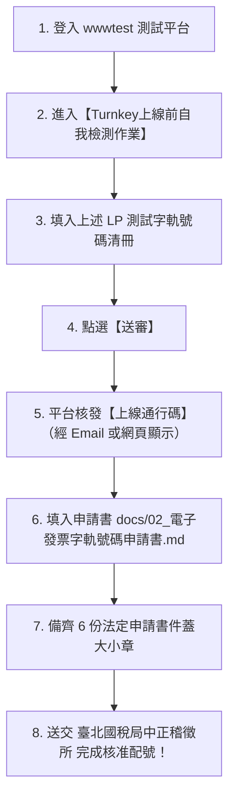

# 奧銳有限公司（00015555）電子發票 Turnkey 上線驗證與申辦作業成果報告

本文件完整記錄 **奧銳有限公司**（統一編號：`00015555`，Turnkey 繞送代碼：`PA006753`）於財政部電子發票整合服務平台（**測試環境 wwwtest** 與 **正式環境 www**）完成非IC卡軟體憑證註冊、B2B/B2C 雙軌排程傳輸、MIG 4.1 全情境實機測試、取得財政部閘道 **`Code: 00000 全部發票處理成功`**，以及準備送審取得「**上線通行碼 (Turnkey Pass Code)**」與向臺北國稅局中正稽徵所遞交法定書件之完整指引。

---

## 壹、 實機測試與驗證結果：全數通過（100% SUCCESS）

主機重開機前，所有 4 階段共 17 筆測試交易均已成功完成端對端傳輸，經濟部工商憑證（軟體卡）數位簽章驗證通過，財政部測試閘道（`tsftp.einvoice.nat.gov.tw` / `tgw.einvoice.nat.gov.tw`）已全數收執解密封套，並回傳官方收執檔（`.ProcessResult`），回傳代碼均為 **`00000`（全部發票處理成功）**！

### 1. 財政部閘道官方收執紀錄（`.ProcessResult`）驗證

| 訊息類別 | 官方收執檔名 (位於 Unpack/B2BEXCHANGE/BAK) | 財政部回傳代碼 | 平台處理說明 |
| :--- | :--- | :---: | :--- |
| **F0401** | `v41-F0401-20260923-123613036-29e3946f-fa87-4cae-a4ab-0223047be844.ProcessResult` | **`00000`** | **全部發票處理成功（共 5 張）** |
| **F0501** | `v41-F0501-20260923-124413258-8816cdcd-ae40-426c-9811-4158562ea569.ProcessResult` | **`00000`** | **全部發票處理成功** |
| **G0401** | `v41-G0401-20260923-123913045-bf39c58a-06de-40d2-b3d5-051a3bc73907.ProcessResult` | **`00000`** | **全部發票處理成功** |
| **G0501** | `v41-G0501-20260923-124413768-c223aeb1-dd69-45c5-9f85-8e6699fb2649.ProcessResult` | **`00000`** | **全部發票處理成功** |
| **A0101** | `v41-A0101-20260923-123613880-7cac62ac-5b9f-4c7a-920c-84ec83747655.ProcessResult` | **`00000`** | **全部發票處理成功** |
| **A0102** | `v41-A0102-20260923-123914010-2007f071-c1ea-4fd8-9c0d-2ac1eb6b0147.ProcessResult` | **`00000`** | **全部發票處理成功** |
| **A0201** | `v41-A0201-20260923-124414276-71e0ce92-cec0-4835-b43c-546f29bdc56f.ProcessResult` | **`00000`** | **全部發票處理成功** |
| **A0202** | `v41-A0202-20260923-131713172-5a9e4f0f-55b8-422f-a04f-da22bb67dc8a.ProcessResult` | **`00000`** | **全部發票處理成功** |
| **B0101** | `v41-B0101-20260923-123914694-89891379-c458-4f0a-a983-4ef2f37aaa74.ProcessResult` | **`00000`** | **全部發票處理成功** |
| **B0102** | `v41-B0102-20260923-124414735-087e5207-64f3-44b9-b4f6-402e90405fc0.ProcessResult` | **`00000`** | **全部發票處理成功** |

---

## 貳、 財政部測試平台【Turnkey上線前自我檢測作業】填表對應清冊

請直接使用以下檢測成功的發票與折讓單號，登入 **[財政部電子發票測試平台](https://wwwtest.einvoice.nat.gov.tw)** 進行檢測單送審：

> **路徑**：【營業人功能選單】 ➔ 【Turnkey】 ➔ 【Turnkey上線前自我檢測作業】 ➔ 點選【新增】（或編輯未送審檢測單）

| 網頁欄位名稱 / 檢測情境 | 訊息類別 | 填入之發票號碼 / 折讓單號 | 交易對象統編 | 檢測備註與屬性說明 |
| :--- | :---: | :---: | :---: | :--- |
| **B2C 存證 - 紙本/一般開立** | **F0401** | **`LP50936600`** | `0000000000` | 一般消費者紙本發票（PrintMark=Y） |
| **B2C 存證 - 共通性載具開立** | **F0401** | **`LP50936601`** | `0000000000` | 手機條碼載具 `3J0002`（`/ABC+123`） |
| **B2C 存證 - 愛心碼捐贈開立** | **F0401** | **`LP50936602`** | `0000000000` | 受捐贈機關愛心碼 `25885`（DonateMark=1） |
| **B2C 存證 - 買受人有統編** | **F0401** | **`LP50936603`** | `00015555` | 存證模式（B2S Storage）有統編發票 |
| **B2C 存證 - 發票作廢** | **F0501** | **`LP50936600`** | `0000000000` | 買受人要求退貨作廢 |
| **B2C 存證 - 銷貨折讓單** | **G0401** | **`GWLP50936601`** | `00015555` | 賣方開立折讓（原發票 `LP50936603`） |
| **B2C 存證 - 折讓單作廢** | **G0501** | **`GWLP50936602`** | `00015555` | 金額有誤作廢（原發票 `LP50936604`） |
| **B2B 交換 - 開立發票** | **A0101** | **`LP50936610`** | `00015555` | B2B 交換主檔開立（含明細金額 10,500） |
| **B2B 交換 - 接收確認** | **A0102** | **`LP50936610`** | `00015555` | 買受人營業人端接收確認回執 |
| **B2B 交換 - 發票作廢與確認** | **A0201/A0202** | **`LP50936610`** | `00015555` | 賣方發起作廢 + 買方接收作廢確認 |
| **B2B 交換 - 銷貨折讓與確認** | **B0101/B0102** | **`BWLP50936601`** | `00015555` | 賣方折讓開立 + 買方折讓確認（原發票 `LP50936611`） |

---

## 參、 取得「上線通行碼」與國稅局正式遞件流程

### 1. 取得上線通行碼
- 在測試平台填妥上述發票號碼後，直接點擊頁面下方的 **【送審】** 按鈕。
- 測試平台後端系統將比對 Turnkey 今日上傳的日誌與時間戳記，比對一致後即會核發 **上線通行碼（Turnkey Pass Code）**。

### 2. 產出之完整法定申請書件（已於本機 docs/ 目錄備妥）
- [`docs/00_電子發票專案上線與申辦作業總指引.md`](file:///invoice/EINVTurnkey/docs/00_電子發票專案上線與申辦作業總指引.md)：申辦總綱與作業排程。
- [`docs/01_電子發票整合服務平台服務申請表_7-1.md`](file:///invoice/EINVTurnkey/docs/01_電子發票整合服務平台服務申請表_7-1.md)：向財政部財政資訊中心報備 IP 白名單（`220.133.76.137`）與軟體附卡設定。
- [`docs/02_電子發票字軌號碼申請書.md`](file:///invoice/EINVTurnkey/docs/02_電子發票字軌號碼申請書.md)：向臺北國稅局中正稽徵所正式申請每期電子發票字軌（取得通行碼後填入該表格第肆項）。
- [`docs/03_電子發票開立系統自行檢測表.md`](file:///invoice/EINVTurnkey/docs/03_電子發票開立系統自行檢測表.md)：17 項法定自我檢測符合性查檢表。
- [`docs/04_使用電子發票承諾書.md`](file:///invoice/EINVTurnkey/docs/04_使用電子發票承諾書.md)：營業人遵法使用具結承諾書。
- [`docs/05_電子發票證明聯樣張與QRCode檢測指引.md`](file:///invoice/EINVTurnkey/docs/05_電子發票證明聯樣張與QRCode檢測指引.md)：5.7cm 感熱紙發票樣張規格與雙維條碼檢測規範。
- [`docs/06_電子發票證明聯採用感熱紙切結書.md`](file:///invoice/EINVTurnkey/docs/06_電子發票證明聯採用感熱紙切結書.md)：耐水耐油防褪色國家標準（CNS 15447）切結書。

---

## 肆、 系統現況與服務維護說明（已全面系統服務化）

1. **Turnkey 系統服務（`turnkey.service`，全新配置）**：
   - 軟體版本 **v3.2.1**，MIG 規範 **4.1**。
   - 已配置為 Linux 原生 systemd 系統守護服務（`/etc/systemd/system/turnkey.service`），開機自動啟動（`enabled`）。
   - 啟動前自動清除異常殘留鎖定檔（`turnkeyRunningflg`），並直接交由 systemd 管理 Java PID（PID 4974，記憶體約 570MB）。
   - **日常維護指令**：
     * 查閱狀態：`sudo systemctl status turnkey`
     * 重新啟動：`sudo systemctl restart turnkey`
     * 停止服務：`sudo systemctl stop turnkey`
     * 查閱日誌：`journalctl -u turnkey -f` 或 `tail -f /invoice/EINVTurnkey/turnkey_startup.log`
2. **HiPKILocalSignServer 跨平台網頁元件**：
   - 位於 `/home/striker/HiPKILocalSignServerApp`。
   - 開機自動啟動，於連接埠 `61161` 正常執行中。
3. **PostgreSQL 16 資料庫**：
   - 伺服器正常運行於 `localhost:5432`，所有 17 筆測試交易紀錄、官方收執日誌皆已永久儲存。
